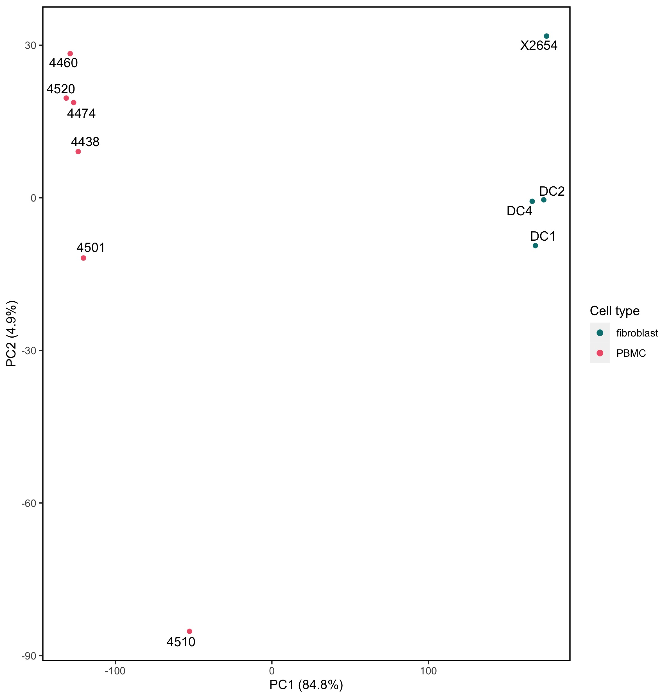
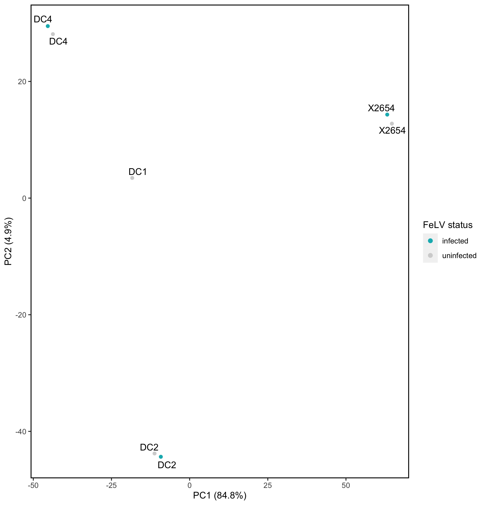

```{r setup, include=FALSE}
knitr::opts_chunk$set(message = FALSE)
start_time <- Sys.time()
```


```{r, message=FALSE, eval=F, echo=F}
library(tidyverse)
library(here)
# dir.create("outputs/001", recursive = TRUE, showWarnings = FALSE) #no longer using this structure since I'm trying to use snakemake
```

## Overview
We have 39 RNAseq libraries from the following samples (start a summit session and use opt+cmd+return to send to terminal):
```{bash, eval=F} 
ls /scratch/summit/camcd@colostate.edu/felv_rnaseq/data/samples/
```

Samples are named such as: `4438_S1_L002_R1_001.fastq.gz` in the `data/raw` directory. L002 is common to all files and indicates sequencing lane. 001 is also common to all files and is just the standard Illumina append. S indicates sample. I could shorten all filenames in `data` like so:

```{bash, eval=F}
for fname in *.fastq.gz ; do mv "$fname" "$(echo "$fname" | sed -r 's/L002_//')" ; done
for fname in *.fastq.gz ; do mv "$fname" "$(echo "$fname" | sed -r 's/_001//')" ; done
```

However, it's best practice to __not__ rename samples. For Snakemake, a better option is to hardlink to the files, rename with tidy sample names (e.g. S001), then use input functions and wildcards on these.

## Pipeline
I'd like to start using Snakemake, as recommended by Eric Anderson. In the meantime, I'll do the following pipeline with batch scripts:

1. run fastqc
1. run multiqc
1. trim
1. re-run fastqc on trimmed libraries
1. re-run multiqc on trimmed libraries
1. run STAR in quantmode

### fastqc + multiqc
Because fastqc assigns 250MB per cpu and I want to try using 19 cores, I requested 5GB (250 x 19 = 4750).

I submitted the [fastqc.sh](workflow/scripts/fastqc.sh) script via:

```{bash, eval=F}
sbatch workflow/scripts/fastqc.sh
```

With the `--test-only` flag first to make sure I wasn't requesting more memory than existed. This took ~2.5 hours to run. This could definitely be better optimized as a job array...

### Trimegalore

Trimgalore worked great as a loop with standard quality and read length flags. See [trimgalore_test.sh](scratch/trimgalore_test.sh).

### STAR (`quantMode`)

Ran STAR in `quantMode`, which generates gene-level quantifcation files. [starquant_test.sh](scratch/starquant_test.sh).

I then just used bash one-liners to compile the __unstranded__ output into a counts matrix:

```{bash, eval=F}
ls *ReadsPerGene.out.tab | paste -s - > samplenames.txt

for i in *ReadsPerGene.out.tab; do awk '{print $2}' $i > $i.unstranded; done

cat samplenames.txt unstranded_counts.txt > unstranded_counts_matrix.txt

awk '{print $1}' X2654PLUS_S14_L002_ReadsPerGene.out.tab | paste - unstranded_counts_matrix.txt > readcountsmatrix.txt

```

__Note:__ I don't know if Elliott used a stranded library prep, so just using unstranded counts data at the moment.


### edgeR

I used the [readcountsmatrix.txt](readcountsmatrix.txt) and the sample [metadata](data/felv_metadata.tsv) to begin edgeR analyses.

#### Data exploration

Code: [DGE_dataexplore.R](workflow/scripts/DGE_dataexplore.R)

Looking at all samples, we can see that there are 31,493 genes in the full dataset. After modest filtering for sequence errors, that goes down to ~16,000 genes. Library size ranged from 2,692,910 (MischiefPlus) to 33,912,615 (DC4PLUS). 

```{r, echo=F}

library(here)
library(tidyverse)
library(edgeR)
library(pheatmap)


#### 0. Get data ####
## counts
dat <- read_delim("readcountsmatrix.txt", delim = "\t") %>% select(-DC2Pool, -DC3Pool)
mapping_dat <- dat[c(1:4, 31498),]
counts <- dat[-c(1:4, 31498),]

## metadata
meta <- read_tsv("data/felv_metadata.tsv") %>% filter(id_inf != c("DC2Pool", "DC3Pool")) %>% filter(id_inf != "DC1PLUS")
Cell_type=meta$cell_type
Infection_status=meta$status
Population=meta$population
cell_inf=paste(meta$cell_type, meta$status, sep="_")


#### 1. Create DGElist, filter by CPM, and calcNormFactors ####
## Create DGEList
dat.full <- DGEList(counts=counts[,2:16], group=cell_inf, genes = counts[,1])
# dat.full$samples$group

## Filter
keep_counts<-rowSums(cpm(counts[,2:16])>1) >= 0.25*ncol(dat) #filter >1 cpm in >= 1/2 of samples

dat.filt<-dat.full[which(keep_counts==T), , keep.lib.sizes=FALSE]
# dim(dat.full)
# dim(dat.filt)

dat.norm<-calcNormFactors(dat.filt)
dat.norm$samples #normalization factors and library size
```

That's way too few reads for the Mischief (puma) samples. When we look at sample correlation and a PCA, we can also see that they're way different from the other fibroblast samples, which is probably a function of poor sequencing, and is not biologically relevant. So, we should remove the Mischief samples from further analyses.

```{r, echo=F}
#### 2. Generate moderated, logCPM counts matrix for sample correlation and PCA ####
dat.logCPM <- cpm(dat.norm, log=TRUE, prior.count = 1, normalized.lib.sizes = TRUE)


#### 3. Generate sample correlation matrix and pheatmap ####
## annotate columns by tissue, treatment, and time
annotation_col1 <- data.frame(
  Cell_type,
  Infection_status,
  Population
)
rownames(annotation_col1) <- colnames(dat[,c(2:16)])

ann_colors1 = list(
  Cell_type =c(fibroblast="#008080",PBMC="#ef6079"),
  Infection_status = c(infected = "#00b6bd", uninfected = "lightgrey"),
  Population = c(outbred = "#065b9b", puma = "#c29a2b", SPF = "#83308c")
  )


## Generate pheatmap
# pdf(file="plots/sample_correlation.pdf", width=9,height=7)
pheat_samplecor <- pheatmap(cor(dat.logCPM),
                            annotation_col=annotation_col1,
                            annotation_names_col=F,
                            annotation_colors=ann_colors1,
                            annotation_row=annotation_col1,
                            annotation_names_row=F,
                            angle_col= "45",
                            border_color = NA,
                            show_rownames = F,
                            show_colnames = F
                            #cutree_cols = 3,
                            #cutree_rows=3
)
# dev.off()
```

<br>

```{r, echo=F}

#### 4. Generate PCAs, look for outliers and batch effects ####
## Generate PCA
counts.pca<-prcomp(t(dat.logCPM))
s<-summary(counts.pca)
# s$importance
scores<-as.data.frame(counts.pca$x)

Mischief <- scores[12,]
meta_mischief <- meta[12,]

## By cell type:
pca <- ggplot(data=scores, aes(x=PC1, y=PC2, group=Cell_type)) + 
  geom_point(aes(color=Infection_status, shape=Cell_type, size=Cell_type)) +
  scale_color_manual(values=c("#00b6bd", "lightgrey")) +
  scale_size_manual(values=c(3,3)) +
  theme(panel.border = element_rect(colour = "black", fill=NA, size=1)) +
  theme(panel.background = element_blank(), panel.grid = element_blank()) +
  xlab ("PC1 (69.9%)") +
  ylab ("PC2 (21.2%)") +
  guides(colour = guide_legend(override.aes = list(size=3)))
# pca
# pca + annotate("text", label=meta_mischief$population, x=Mischief$PC1, y=Mischief$PC2, size=3)
pca + annotate("text", label=meta_mischief$population, x=(-105), y=258, size=4)
# ggsave(file="plots/pca_all.eps")

```

#### Differential expression

Code: [DGE_edgeR.R](workflow/scripts/DGE_edgeR.R)

So there are a couple comparisons we can make:

- Cell type differential expression (PMBCs vs fibroblasts)
- uninfected vs. FeLV-infected differential expression (fibroblasts only)

Looking at cell type, 4510 is a big outlier, again I suspect due to poor sequencing.



Expression is clearly cell-specific, which we would expect. There are ~6,000 genes significantly differentially expressed between fibroblasts and PMBCs.

Looking at FeLV infection status, we see that infection status plays a pretty negligible role:


Samples cluster according to biological replicate and not according to infection status. Thus, we end up with only 3 significantly DE genes, all of which are uncharacterized proteins.
