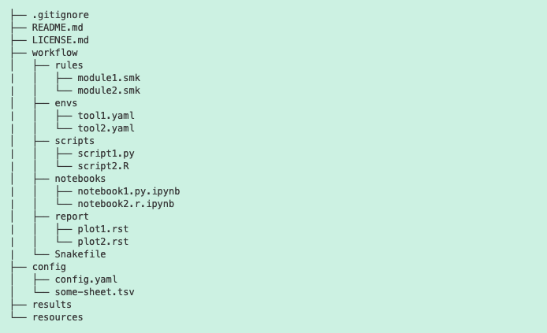

```{r setup, include=FALSE}
knitr::opts_chunk$set(echo = TRUE)
start_time <- Sys.time()
```

-----

#### Note: this largely follows Eric Anderson's [microhap workflow](https://github.com/eriqande/mega-simple-microhap-snakeflow).
I'm also trying to write these notes so they can work as a Snakemake tutorial as well, for when I inevitably forget what I've done.

-----

## Organizing my data
Input data is all stored within a `data/` directory, which includes:

- `metadata.txt` detailing sample information
- `raw/` directory with all raw seq files

```{r, eval=T, message=F}
library(here)
library(tidyverse)
library(knitr)

metadata <- read_delim("data/felv_metadata.tsv", delim="\t")
head(metadata)
```

We can set this as our run dir in our `config.yaml` file.

<br>

## Notes on organization

For [reproducibility](https://snakemake.readthedocs.io/en/stable/snakefiles/deployment.html), it's best to organize your directories as suggested:



So, all rules are written as individual `.smk` files in a `rules` directory, and then called by the Snakefile. Note that when thinking about paths, you do *not* need to include `workflow/` because Snakemake infers it (so `envs/tool1.yaml`, not `workflow/envs/tool1.yaml`).

<br>

## Designing the workflow
To avoid rewriting rules for future projects, I want to write rules that are as modular as possible. My workflow for this project is:

1. QC
1. Read trimming
1. QC
1. STAR (align and quant)

From here, I could easily add in rules for other programs (e.g. Trinity, bowtie2, RSEM, salmon).

<br>

## Writing and testing rules
To make the rules modular, I need to figure out some sort of wildcard for file paths and naming, in addition to the standard wildcard for sample.

We can add even more modularity by putting function definitions that might be called by multiple rules into a `common.smk` file...for example, within that common file I could have:

```{bash, eval=F}
def get_raw_fastqs(wildcards):
    """Get path to raw fastq files"""
    return r"{run_dir}/raw/{fq}".format(run_dir=wildcards.run_dir, fq=wildcards.fq)

def get_trimmed_fastqs(wildcards):
    """Get path to trimmed fastq files"""
    return r"{run_dir}/trimmed/{fq}".format(run_dir=wildcards.run_dir, fq=wildcards.fq)

```

## Snakemake: QC rules
One annoying thing is that Snakefile scripts are much nicer to write in Atom than Rmd. So not totally sure how I'll integrate everything? Also not sure about how to integrate Snakemake with SLURM.

After going through the Snakemake [tutorial](https://snakemake.readthedocs.io/en/stable/tutorial/tutorial.html), I've set up my directories and environments as suggested, and created a [Snakefile](workflow/Snakefile). One super useful utility is `tree`, which allows you to visualize directory structure. (I currently have this installed in the snakemake conda env). I went through quite a bit of troubleshooting and was able to get the first `fastqc_raw` rule to work with:

1. Full file names (pointless, but a good exercise)
1. A basic `{sample}` wildcard
1. A config file
1. A config file + input function
1. Importing metadata via pandas + input function

Via:
```{bash, eval=F}
conda activate snakemake
snakemake -np results/fastqc/raw/4438_S1_L002_R1_001_fastqc.html
```

__NOTE 1:__ If I try to run with a conda environment that includes both fastqc and multiqc, I get a PIP error:

          Building DAG of jobs...
          Creating conda environment workflow/envs/qctrim.yaml...
          Downloading and installing remote packages.
          CreateCondaEnvironmentException:
          Could not create conda environment from             /gpfs/summit/scratch/camcd@colostate.edu/felv_rnaseq/workflow/envs/qctrim.yaml:
          Preparing transaction: ...working... done
          Verifying transaction: ...working... done
          Executing transaction: ...working... done
          Installing pip dependencies: ...working... failed
          Pip subprocess error:
          DEPRECATION: Python 2.7 will reach the end of its life on January 1st, 2020. Please upgrade your Python as Python 2.7 won't be maintained after that date. A future version of pip will drop support for Python 2.7. More details about Python 2 support in pip, can be found at https://pip.pypa.io/en/latest/development/release-process/#python-2-support
          ERROR: Could not find a version that satisfies the requirement multiqc==1.0.dev0 (from -r /gpfs/summit/scratch/camcd@colostate.edu/felv_rnaseq/.snakemake/conda/condaenv.1cma2cye.requirements.txt (line 1)) (from versions: 0.1, 0.2.0, 0.3.0, 0.3.1, 0.3.2, 0.4, 0.5, 0.6, 0.7, 0.8, 0.9, 1.0, 1.1, 1.2, 1.3, 1.4, 1.5, 1.6, 1.7, 1.8, 1.9, 1.10, 1.10.1)
          ERROR: No matching distribution found for multiqc==1.0.dev0 (from -r /gpfs/summit/scratch/camcd@colostate.edu/felv_rnaseq/.snakemake/conda/condaenv.1cma2cye.requirements.txt (line 1))

This is because multiqc is downloaded via PIP and not conda and there are known errors when doing [both.](https://www.anaconda.com/blog/using-pip-in-a-conda-environment) Adding granularity and creating two separate environments for fastqc and multiqc resolves it.

__NOTE 2:__ 
I initially tried to use wildcards with truncated filenames (e.g. sample_id=4438_R1 instead of 4438_S1_L002_R1_001). While this works in the input function, I can't then propagate the shortened name because fastqc does not allow you to specify output filenames, so you can't propagate the shortened name. So, I have to use the full filename as sample_id.

My second rule (`multiqc_raw`) *looks like* it's working. I don't know for sure because I already generated all the files directly using a batch script (see below).

